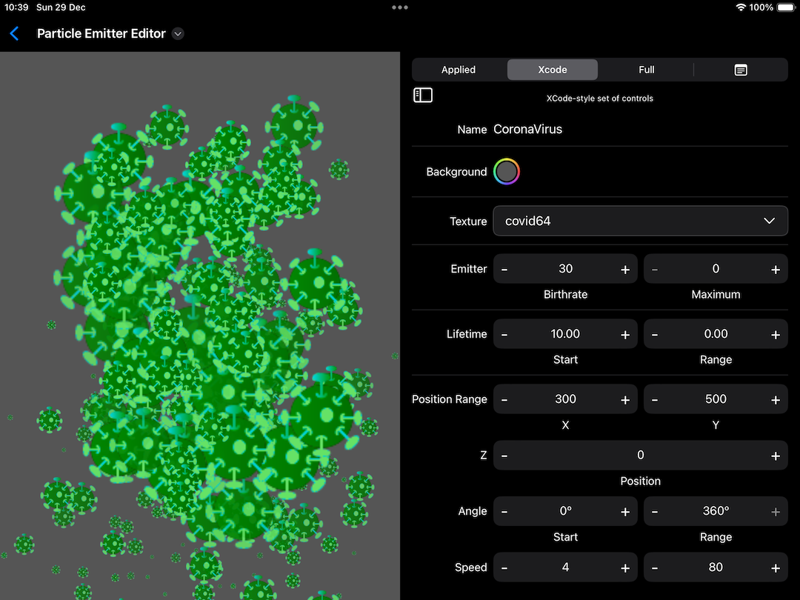

# ColorWelly
Sample to explore a [bug][p2] affecting the [Purrticles][p1] interface on iPad **only** using iPadOS versions 16.x and 17.x.

The two `ColorPicker` controls are almost impossible to tap - most of the time they fail to react and don't show the popover control.

## State of re-creating the Purrticles bug
I'm easing up to a very complex nested screen like you can see here:

That screen comprises:
- overall picker vs "document view"
- three-panels with leftmost often hidden (exported code)
- a big hosted SpriteKit `SKView`
- controls on the right inside a tabbed view
- the controls and backgrounds have many tap gesture recognisers so can detect focus changes and dismiss a keyboard from going into edit mode when you press a number label

### Attempts
- simple with three rows fails to replicate the bug. All pickers work.
- putting a single big view to left of Grid still works
- using our custom view for label to left of ColorPicker 
- adding overall Group and GeometryReader around entire View, so can split up space proportionally
- adding "tabs" as segmented picker control above scrolling controls

[p1]: https://www.touchgram.com/purrticles
[p2]: https://www.reddit.com/r/SwiftUI/comments/1hl4htd/ipad_colorpicker_bug_not_responding_to_taps_on/
