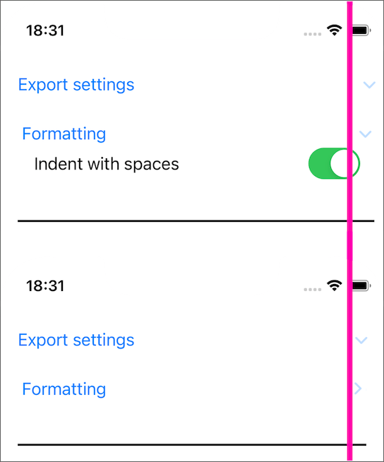
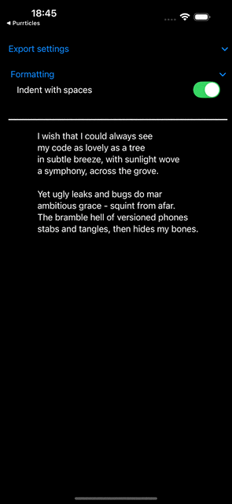

# DiscAGriddable

Exists to explore fixes to an interesting gotcha I had in my MultiPlatform SwiftUI app [Purrticles][p1] export view, with some nested [DisclosureGroup][a1] problems.

## The Problem
With a [Grid][a2] inside the `DisclosureGroup`, toggling the group open causes a minor width expansion. Depending on the model of phone, this results in the disclosure chevrons being unpleasantly close to the trailing side, or vanishing completely off screen!

The minimal amount of layout with the `Grid` shows the problem is inherently one about putting it inside a `DisclosureGroup` as seen in the recording and screenshots below. Note how when Formatting is tapped, the outer chevron jumps sideways. The collapsed width is the desired layout and when the Grid is exposed, it pushes things wider.

## Grudge held
This little bit of nasty UI rendering caught me when I thought I'd utterly finished with _stupid SwiftUI bugs_ after the long wrestling with Undo (see [Docundoable](../Docundoable/README.md) for that saga)

So this is grumpily-written code hence the project name.

[p1]: https://www.touchgram.com/purrticles
[a1]: https://developer.apple.com/documentation/swiftui/disclosuregroup
[a2]: https://developer.apple.com/documentation/swiftui/grid
