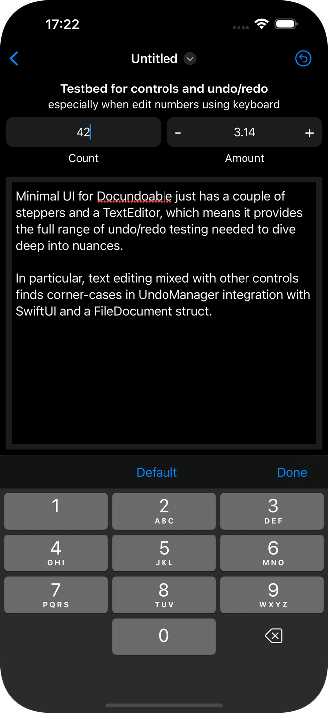
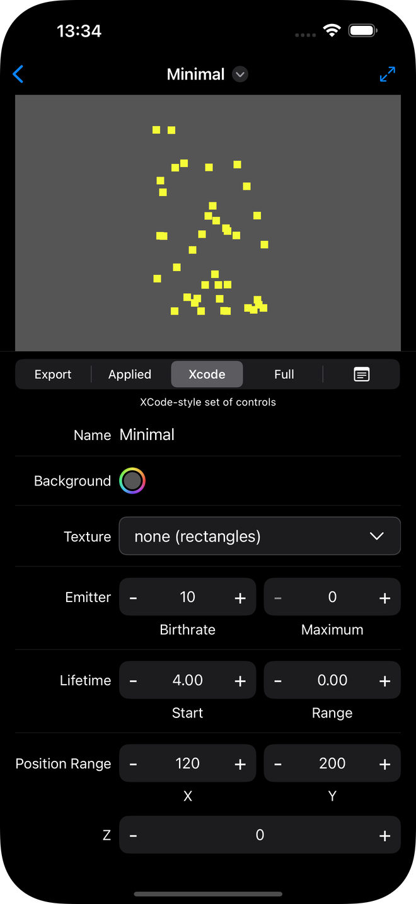

# DocUndoable - Documents and Undo with SwiftUI
Sample to explore nuances of Document-based apps, specifically using the struct approach of [FileDocument][a1] with the [UndoManager][a2].

Got sufficiently frustrated during the development of [Purrticles][p1] with its complex editing environment that wanted both to explore the alternatives and have a sample I coud share to accompany articles/rants about the issues.

Note that in the following discussions may abbreviate UndoManager to UM.

This readme includes a growing discussion at bottom of testing as different twists on UM use tried. In summary, there are multiple buggy behaviours with UndoManager when you have a nested editor as shown here in `StepperNumView` (screenshots at end).


## Nested views vs Undo

### Combination control with an ephemeral TextField
The main [Purrticles][p1] control views mimic XCode's Particle Emitter editor with a panel of controls that have a stepper combined with tappable, editable label.

As is common SwiftUI practice, I use a separate View to provide these.

StepperNumView has a label which, when tapped, shows a TextField the width of the control.

Using UndoManager, an undo can be triggered:

1. after tapping the decrement or increment buttons
2. whilst editing the text field, after each character typed.

**But** when focus is lost from the control, it seems to reset the UndoManager state, so `canUndo` becomes false.

This project explores that problem in a vastly-simplified sample.

See **Explorations** section below.


## Common Gotchas

### Wanting UndoMager in a doc
As per this [StackOverflow question][so1] it is common to have data handling code in your _Document_ class or struct, that may want to call [UndoManager][a2] functions.

The safe way to pass this is to be aware of the UndoManager only being valid in context of a SwiftUI View and that it can change during the lifetime of the view, especially being nil at initial appearance. This was picked up in a good [Hacking with Swift forum post][hws1].

So, to cope with all scenarios:

```
struct DocumentView: View {
    let document : MyDocument
    @Environment(\.undoManager) var undoManager  // get from environment, don't pass from above
    
    var body: some View {
        MyDocumentEditor(document: document)
        .onAppear {
            document.setUndoManager(undoManager)
        }
        .onChange(of: undoManager) { _ in
            document.setUndoManager(undoManager)
        }
    }
}
```

### Testing undo availability
We want Undo/Redo buttons to be enabled when such info is available.

The obvious way is to use the UndoManager:

```
struct MainDocWindow: View {
    @Environment(\.undoManager) var undoManager
    var body: some View {
...    
        .toolbar {
            #if os(iOS)
            ToolbarItem(placement: .navigationBarTrailing) {
                Menu {
                    Button(action: undo) {
                        Label(undoManager?.undoMenuItemTitle ?? "", 
                        	systemImage: "arrow.uturn.backward")
                    }
                    .disabled(!(undoManager?.canUndo ?? false))
                    Button(action: redo) {
                        Label(undoManager?.redoMenuItemTitle ?? "",
                        	 systemImage: "arrow.uturn.forward")
                    }
                    .disabled(!(undoManager?.canRedo ?? false))
                } label: {
                    Image(systemName: "arrow.uturn.backward.circle")
                }
                .menuStyle(BorderlessButtonMenuStyle())
            }
            #endif
        }       
```

However, as noted in [this SO answer][so2]

> UndoManager.canUndo is not KVO compliant

Which means that you can't rely on the values of `canUndo` etc. being updated to cause SwiftUI view changes to enable the menu items.

Even worse, if you have a change event or callback from your own `undo` command that queries `canRedo` it will cause termination of some UndoManager states:

> canRedo fires the checkpoint notification: "Posted whenever an NSUndoManager object opens or closes an undo group (except when it opens a top-level group) and when checking the redo stack in canRedo." 

I ended up completely ignoring `canUndo` and the `undoMenuTitle` and implementing my own.


## File I/O
The simple approach is taken of using Codable to encode as JSON.

Rather than having possible complications between FileDocument and Codable, a 3-property helper struct is used so synthesis occurs to trivially encode it as JSON.


## Menu Commands on macOS
After the explorations below resulted in a robust iOS solution, turned my attention to macOS and of course we have standard **Edit** menu Undo and Redo without the toolbar. So, somehow, these need hooking up. This is complicated by a macOS SwiftUI document app being automatically multi-window.

[This Hacking with Swift article][hws2] talks about using the UndoManager and focuses on getting it available correctly in a multi-window Mac. That's not helpful for _avoiding_ UndoManager and a little scary if it implies we _must__ use UM.

### Making active doc available to menu commands
The command definitions, if in a separate file, need to know the current _active_ document aka viewModel. This [StackOverflow answer][so3] neatly covers that using `@FocusedValue` and injecting from the view with `.focusedSceneValue`.

However, because we want to call mutable funcs, a `@FocusedBinding` is needed.

### Edit menu item replacements
The [standard Edit menu][a3] has Undo and Redo already.

We want somehow to _connect_ those to our code, so titles can be changed and we can act on the right document.

Apple's [Article Accelerator sample][a4] shows customising them in the `Scene` attached to the `Window`. For a document-based app, our `Scene` contains a `DocumentGroup` which also accepts a `.commands` to specify the `CommandBuilder`. To get the current document into that builder, the `.focusedSceneValue` approach as above has to  be used.


## Explorations - Detailed testing of UndoManager & Alternatives
Note that shake (triggered by cmd-ctrl-Z on simulator) is only available  whilst editing the text field and prompts with an Undo/Redo Typing alert that is a smart chunk of editing.


### Basic Undo/Redo
After commit db8e304 _Add undo/redo using UndoManager_ testing the app

- Undo menu appears with undo/redo titles that remain generic "Undo" and "Redo"
- undo and redo appear to be disabled correctly when stacks empty
- each individual character edit of note is separate undoable item
- redo stack not emptied by moving on to new focus (this seems different to Purrticles) so if you have undone say 4 actions across 3 controls, you can redo them all
- shake undo actions (see above) appear as yet another undoable item on our menu! (expected Redo) - seems the shake integration in TextField is seen as a positive editing action by generic UM as if you were typing, not integrated into stack.

### Naming undoables
After commit d82b027 _Add undo/redo naming using UndoManager in doc_ testing the app with more clarity as can see what's _intended_ to be undone/redone.

- Still have the same behaviours as previously with the undo/redo working, being stackable_
- Menus now have simple name changes reflecting what was changed so can see when am in a state where offering different like **Undo count** with **Redo amount**. (This proves I'd misunderstood how Redo worked, thinking it was wiped by changing which value being edited)
- **BUG?** On at least a couple of occasions found the undo menu was still enabled after had clearly wiped out the entire stack, now visible because the name reverted to the generic _Undo_ rather than _Undo count_. This seems hard to reproduce though, unlike when I observed in Purrticles. Maybe related to complexity of use.
- **BUG!** Now testing editing the centre value of the steppers by tapping and **bug seen** where the UM has apparently recorded a second undo state transition, _just for entering the edit field,_ without a visible value change, when cease editing number value, by some other operation that shifts focus.eg:
	- count is 58 when open doc
	- tap label to edit
	- tap note to change focus
	- check undo menu and it now has an enabled **Undo count**
- further note on that buggy extra undo when enter edit mode - it wipes the **Redo** state _and_ the name of the actions.
- this _only_ occurs when entering the TextField in `StepperNumView` and not the `TextEditor`

	    
### Tap to dismiss and more didSet testing
After commit 53eafc1 _Add focus change by tapping background, to dismiss keyboard_ testing app 
- Confirmed can dismiss keyboard when have gone into edit mode then tap background between controls.
- Noted that showed no behavioural changes in values, so just focTag = nil has no side-effects on UndoManager
- **BUG! (same?)** testing further with the print statement to see when `didSet` is invoked when start editing by tapping middle of steppers, testing by tapping inc button then edit, seeing logged values, including the surprise that `didSet` is invoked **twice** each time when editing those fields. This may relate to the change in Undo/Redo state and name noticed in previous commit:
	- `didSet count old=55 new=56` from inc
	- `didSet count old=56 new=56` **twice** just on entering editor (note **one** Undo is added to stack, which has no effect because no value change)
	- `didSet count old=56 new=5` printed showing the _actual edit_ changed values
	- `didSet count old=5 new=5` printed immediately after as _just more noise_


### Keyboard attached buttons to dismiss & setDefault
After commit 2589922 _Add focus change and setting by buttons on keyboard_ testing app
- no changes noted in behaviour
- pressing the **Default** button on `count` shows the `didSet` print being hit, as expected, as an explicit set of the value occurs. 


### Replace UndoManager entirely
After commit 9cd2b46 _Remove UndoManager entirely and manage ourself_ testing app to prove works as desired.
- all undo/redo behaviour works as when using UM and it behaved, including redo with a different name from current undo
- reliably disables/enabled menu items
- titles are generic "Undo"/"Redo" only when disabled

### Use classes for Doable
There's enough abstraction being done in the `Doable` structs that implement the protocol, that it seems cleaner to convert them to classes. The `undoStack` and `redoStack` have to manage them as references boxing structs anyway.

So this final _exploration_ is just that code refactoring, commit 3589aad, with testing to confirm no silly bugs introduced.


## StepperNumView in action

### Docundoable editing a stepper value
Tapping the center label puts it into edit mode. Note the added **Default** and **Done** buttons. These not only enhance the numeric keyboard but trigger another corner-case with focus updates as discussed in the explorations above.




### [Purrticles][p1] UI
Screenshot of the app in which had the original problem. In the "Full" mode has 35 of these controls on the view.




[p1]: https://www.touchgram.com/purrticles

[a1]: https://developer.apple.com/documentation/swiftui/filedocument
[a2]: https://developer.apple.com/documentation/foundation/undomanager
[a3]: https://developer.apple.com/design/human-interface-guidelines/the-menu-bar#Edit-menu
[a4]: https://developer.apple.com/tutorials/app-dev-training/customizing-menus-with-commands-and-shortcuts

[so1]: https://stackoverflow.com/questions/63919607/capturing-undomanager-from-swiftui-environment
[so2]: https://stackoverflow.com/questions/60647857/undomanagers-canundo-property-not-updating-in-swiftui
[so3]: https://stackoverflow.com/a/72954378/53870

[hws1]: https://www.hackingwithswift.com/forums/macos/undomanager-tinydraw-hws-and-view-onappear/11359
[hws2]: https://www.hackingwithswift.com/forums/macos/swiftui-app-life-cycle-undo-redo-and-menu-bar-items/7771
